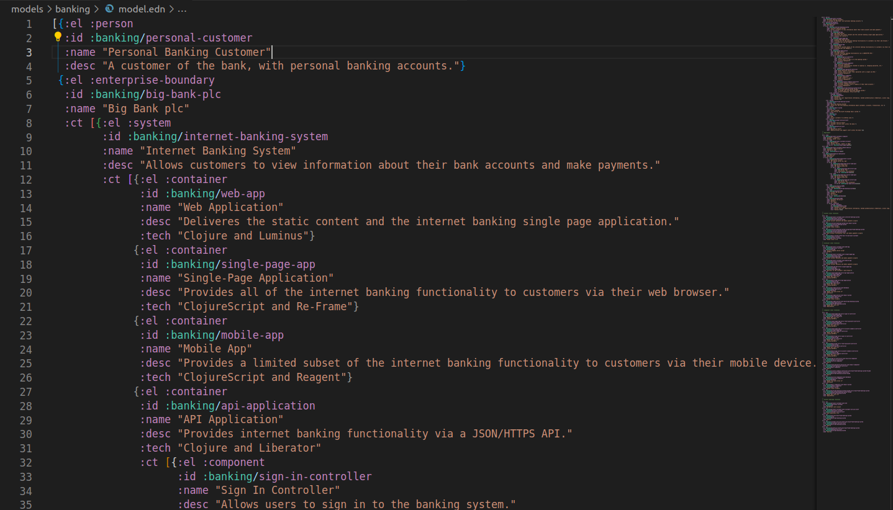

## overarch
### data driven system modelling
### Ludger Solbach


---
<!-- paginate: true -->
<!-- header: "overarch - data driven modelling" -->
<!-- footer: "Ludger Solbach" -->

# Rationale

* system models for
  * communication
  * documentation
  * thinking

---

# Rationale

* commercial modelling tools
  * e.g. Enterprise Architect, Magic Draw
  * comprehensive but complex
  * license needed

---

# Rationale

* drawing tools
  * e.g. Visio, Gliffy, ExcaliDraw
  * pretty pictures only
  * no reuse between diagrams

---

# Rationale

lightweight open source modelling

data driven and text based

with visualization

### => **overarch**

---

# Models

* models as data
  * concept models, concept maps and glossaries
  * system landscape and architecture, deployment
  * use cases, state machines and class models
 * hierarchical models and element references
 * composable / reusable
 * extensible format

---

# Views

* views as data
  * separation of models and views
  * view specific customization of model elements
 
---

# Rendering

 * PlantUML
   * C4 views, UML views
     * use case, state machine and class diagrams
   * styling and sprite support
 * GraphViz
   * Concept maps
 * Markdown
   * Glossary, textual representations of graphical views

---

# Exporting

* exports
  * JSON if you need to process models with languages without EDN support
  * Structurizr *experimental*

---

# Example Model



---

# Example View


---

# Example Diagram


---

# Example Diagram


---

# Extensible Data Notation (EDN)

Similar to JSON but richer set of data literals
Subset of Clojure

---

# EDN - Primitives

Numbers: ```123```
Strings: ```"Hello"```
Keywords: ```:keyword```, ```:namespaced/keyword```

---

# EDN - Data Structures

Vectors: ```["a" "b" "c"]```
Sets: ```#{"a" "b" "c"}```
Maps: ```{:a "a" :b "b" :c "c"}```

Data structures can be nested

---

# Modelling Example
```clojure
#{ ; set of model elements
  {:el :system
   :id :example/system1
   :name "Example System"
   :desc "An example system to show how to model in overarch"
   :ct #{ ; set of children
         {:el :container
          :id :example/container1
          :name "Example Container"
          :tech "Java"
          :desc "Deployable application in the example system"}}}
}
```

---

# Modelling Methods

**C4 Model**: Architecture Model, Deployment Model, Dynamic Model
**UML**: Use Case Model, Class Model, State Machines
**Concept Maps**: Concept Model

---

# Architecture Model

#### Elements
:person :system :container :component
:enterprise-boundary :context-boundary

#### Relations

---

# Deployment Model

#### Elements
:node :system :container :component

#### Relations

---

# Dynamic Model

#### Elements
:person :system :container :component

#### Relations

---

# Use Case Model

#### Elements
:use-case :actor :person :system :context-boundary

#### Relations
:uses :include :extends :generalizes

---

# State Machine

#### Elements
:state-machine :start-state :state :end-state :fork :join
:choice :history-state :deep-history-state

#### Relations
:transition

---

# Class Model

#### Elements
:class :enum :interface :field :method :function
:package :namespace :stereotype :annotation :protocol
    
#### Relations
:inheritance :implementation :composition :aggregation :association :dependency

---

# Concept Model

#### Elements
:concept :person :system :container
:enterprise-boundary :context-boundary

#### Relations

---

# Views

Views define
 * which model elements rendered
 * how the model elements are rendered

---

# Rendering


---

# Export

JSON
EDN
Structurizr (architecture/deployment model and views only)

---


